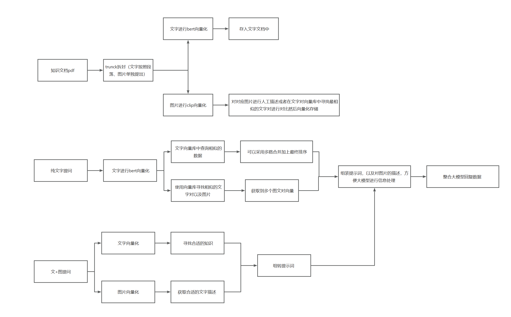

# 多模态RAG项目

## 目录
- [数据管理接口文档](#数据管理接口文档)
- [多模态检索和问答接口定义](#多模态检索和问答接口定义)
- [架构设计](#架构设计)
  - [数据库设计](#数据库设计)
    - [Milvus 向量数据库](#milvus-向量数据库)
    - [MySQL 关系型数据库](#mysql-关系型数据库)
    - [OSS 对象存储服务](#oss-对象存储服务)
  - [潜在问题与改进建议](#潜在问题与改进建议)

## 数据管理接口文档

### upLoadImage 接口
- **请求方法**: POST
- **接口地址**: `/api/v1/image/upload`
- **请求参数**:
  
  | 参数名 | 类型 | 必填 | 描述 |
  |-------|------|------|------|
  | image | file | 是 | 单张图片文件 |
  | images | array[file] | 否 | 多张图片文件 |

- **返回结果**:
  
  ```json
  {
    "code": 200,
    "message": "success",
    "data": {
      "imageIds": ["img_001", "img_002"]
    }
  }
  ```

- **功能描述**:
  - 上传图片至系统
  - 元数据保存在 `mysql` 数据库中
  - 实际图片数据保存在 `oss` 云端存储
  - 图片同时进行向量化（使用 `VIT` 或者 `clip`）保存在 `milvus` 向量数据库中
  - 保证数据的一致性（ACID特性）

### upLoadText 接口
- **请求方法**: POST
- **接口地址**: `/api/v1/text/upload`
- **请求参数**:
  
  | 参数名 | 类型 | 必填 | 描述 |
  |-------|------|------|------|
  | document | file | 是 | 文本文件 |

- **返回结果**:
  
  ```json
  {
    "code": 200,
    "message": "success",
    "data": {
      "documentId": "doc_001"
    }
  }
  ```

- **功能描述**:
  - 对文档进行 `chunk` 划分，文字按段落或其他方式进行划分，允许有重叠
  - 图片单独作为一个 `chunk` 进行向量化存储

### uploadImageText 接口
- **请求方法**: POST
- **接口地址**: `/api/v1/image-text/upload`
- **请求参数**:
  
  | 参数名 | 类型 | 必填 | 描述 |
  |-------|------|------|------|
  | image | file | 是 | 图片文件 |
  | text | string | 是 | 相关文本内容 |

- **返回结果**:
  
  ```json
  {
    "code": 200,
    "message": "success",
    "data": {
      "pairId": "pair_001"
    }
  }
  ```

- **功能描述**:
  - 文件和图片分别都用 `clip` 进行向量化并进行分开存储
  - 文字存入文字的向量库
  - 图片存入图片的向量库

---

## 多模态检索和问答接口定义

### getImageByText 接口
- **请求方法**: POST
- **接口地址**: `/api/v1/image/search`
- **请求参数**:
  
  | 参数名 | 类型 | 必填 | 描述 |
  |-------|------|------|------|
  | text | string | 是 | 查询文本 |
  | limit | integer | 否 | 返回结果数量，默认为5 |

- **返回结果**:
  
  ```json
  {
    "code": 200,
    "message": "success",
    "data": [
      {
        "imageId": "img_001",
        "imageUrl": "https://oss.example.com/images/img_001.jpg",
        "similarity": 0.95
      }
    ]
  }
  ```

- **功能描述**:
  - 文字找向量库中最相似的图片
  - 文字使用 CLIP 向量化（注意：为了与图片向量在同一语义空间，应使用CLIP模型而非BERT）
  - 使用 `milvus` 自带的余弦相似度在图片向量库中找到最合适的图片或者几张图片

### descImage 接口
- **请求方法**: POST
- **接口地址**: `/api/v1/image/description`
- **请求参数**:
  
  | 参数名 | 类型 | 必填 | 描述 |
  |-------|------|------|------|
  | image | file/string | 是 | 图片文件或图片ID |

- **返回结果**:
  
  ```json
  {
    "code": 200,
    "message": "success",
    "data": {
      "description": "这是一张描述图片内容的文本"
    }
  }
  ```

- **功能描述**:
  - 根据图片向量在文字中寻找最合适的文字对

### getSimilarImage 接口
- **请求方法**: POST
- **接口地址**: `/api/v1/image/similar`
- **请求参数**:
  
  | 参数名 | 类型 | 必填 | 描述 |
  |-------|------|------|------|
  | image | file/string | 是 | 图片文件或图片ID |
  | limit | integer | 否 | 返回结果数量，默认为5 |

- **返回结果**:
  
  ```json
  {
    "code": 200,
    "message": "success",
    "data": [
      {
        "imageId": "img_002",
        "imageUrl": "https://oss.example.com/images/img_002.jpg",
        "similarity": 0.89
      }
    ]
  }
  ```

- **功能描述**:
  - 直接向量化搜索图向量库找最相似的图片

### getSimilarText 接口
- **请求方法**: POST
- **接口地址**: `/api/v1/text/similar`
- **请求参数**:
  
  | 参数名 | 类型 | 必填 | 描述 |
  |-------|------|------|------|
  | text | string | 是 | 查询文本 |
  | limit | integer | 否 | 返回结果数量，默认为5 |

- **返回结果**:
  
  ```json
  {
    "code": 200,
    "message": "success",
    "data": [
      {
        "textId": "text_001",
        "content": "相关文本内容...",
        "similarity": 0.92
      }
    ]
  }
  ```

- **功能描述**:
  - 找相关的知识内容

### quiz 接口
- **请求方法**: POST
- **接口地址**: `/api/v1/quiz`
- **请求参数**:
  
  | 参数名 | 类型 | 必填 | 描述 |
  |-------|------|------|------|
  | question | string | 是 | 用户提出的问题 |

- **返回结果**:
  
  ```json
  {
    "code": 200,
    "message": "success",
    "data": {
      "pdfUrl": "https://oss.example.com/reports/report_001.pdf"
    }
  }
  ```

- **功能描述**:
  1. 将文字向量化之后去文档中寻找合适的资料，在图片中寻找合适的图片，同时寻找描述图片的文字对
  2. 填充提示词，大概是文档如下，可用的图片如下，后面追加每张图的描述信息，让 `LLM`（`qwen3AL`）基于知识库进行回答，如果需要展示图片需要告诉系统图片插入的位置
  3. 将信息给到 `LLM` 等待回答数据
  ```json
  {"text":"string ${image1}","image1":"string"}
  ```
  4. 根据大模型回答的数据将图片进行填充最终输出为一个 `pdf` 发送给前端

### quizByImg 接口
- **请求方法**: POST
- **接口地址**: `/api/v1/quiz/image`
- **请求参数**:
  
  | 参数名 | 类型 | 必填 | 描述 |
  |-------|------|------|------|
  | queryText | string | 是 | 查询文本 |
  | image | file/string | 是 | 图片文件或图片ID |

- **返回结果**:
  
  ```json
  {
    "code": 200,
    "message": "success",
    "data": {
      "pdfUrl": "https://oss.example.com/reports/report_002.pdf"
    }
  }
  ```

- **功能描述**:
  1. text 和 `img` 进行向量化（建议使用统一的CLIP模型）
  2. 单独对当前 `img` 进行文字匹配，不再去向量库寻找相似图片
  3. 后续步骤和 `quiz` 一致

## 架构设计

### 数据库设计

#### Milvus 向量数据库

##### 文字知识库向量库
- **集合名称**: text_embeddings
- **维度**: 512 (建议统一使用CLIP模型)
- **索引类型**: IVF_FLAT（可根据实际需求调整）
- **用途**: 存储上传文档中的 chunk 的向量表示

##### 图片向量库
- **集合名称**: image_embeddings
- **维度**: 512 (CLIP)
- **索引类型**: IVF_FLAT（可根据实际需求调整）
- **用途**: 存储上传图片的向量化结果

##### 图片描述向量库
- **集合名称**: image_description_embeddings
- **维度**: 512 (CLIP)
- **索引类型**: IVF_FLAT（可根据实际需求调整）
- **用途**: 存储图片描述文字的向量化结果，用于后续通过图片查询其对应的文字描述

#### MySQL 关系型数据库
- **数据库名称**: multimodal_rag
- **表结构**:
  - images: 存储图片元信息（ID、文件名、OSS路径、大小、创建时间等）
  - texts: 存储文本元信息（ID、文件名、chunk信息、创建时间等）
  - image_text_pairs: 存储图文对关系信息
- **职责**: 存储各类资源的元信息，例如图片大小、OSS 中的实际路径、所属的知识库 ID 等

#### OSS 对象存储服务
- **Bucket命名**: multimodal-rag-images
- **存储结构**:
  ```
  multimodal-rag-images/
  ├── images/
  │   ├── 2025/
  │   │   ├── 11/
  │   │   │   ├── img_001.jpg
  │   │   │   └── img_002.png
  ├── documents/
  │   ├── doc_001.txt
  │   └── doc_002.pdf
  ```
- **职责**: 存储用户上传的所有原始图片文件

### 潜在问题与改进建议

#### 1. 向量维度不一致问题
- **问题描述**: 当前设计中文字使用BERT模型(768维)，图片使用CLIP模型(512维)，维度不一致导致跨模态检索效果不佳
- **改进建议**: 
  - 统一使用CLIP模型处理文本和图像，确保在同一语义空间中
  - 或添加向量映射层，将不同维度向量映射到统一空间

#### 2. 数据一致性保障不足
- **问题描述**: 缺少分布式环境下MySQL、OSS、Milvus三个系统之间的事务一致性保障机制
- **改进建议**:
  - 引入分布式事务管理器（如Seata）
  - 设计补偿机制处理部分失败的情况

#### 3. 索引策略优化
- **问题描述**: 所有Milvus集合都使用IVF_FLAT索引，可能不是最优选择
- **改进建议**:
  - 根据数据规模和查询需求选择合适的索引类型
  - 定期调优索引参数

#### 4. 性能和扩展性考虑
- **问题描述**: 缺少高并发处理能力和水平扩展方案
- **改进建议**:
  - 添加缓存层（如Redis）提升热点数据访问速度
  - 设计微服务架构支持水平扩展

